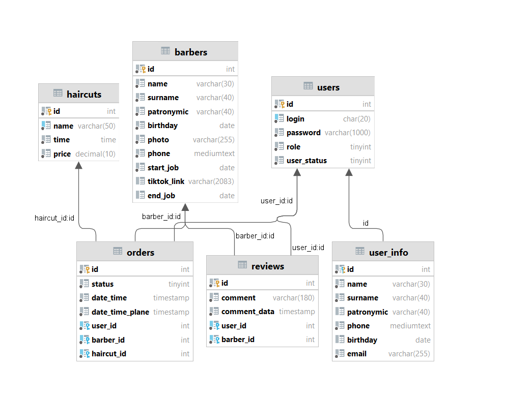

#Barbershop "Magnifique"
A system for the provision of services in the form of hair care for the head and face. The user can register / log in to the system in order to place an order or change it, he will also have access to his personal account to set up his profile, he will also be able to leave reviews about the barber and change them. An unregistered user will be able to get acquainted with all the services provided, barbers.The administrator manages services and users. He can view information about the client, and his orders, approve or reject his order, change, delete.
___
###User roles
* Guest
    * Log In
    * Sign Up
    * View services
    * View barbers
* User
    * View goods
    * Change personal date in the profile
    * Make/delete/change order
    * Write/change/delete review about barber
* Admin
    * delete/block user
    * Edit services
    * Edit barbers
    * Edit orders
    * Remove any review

